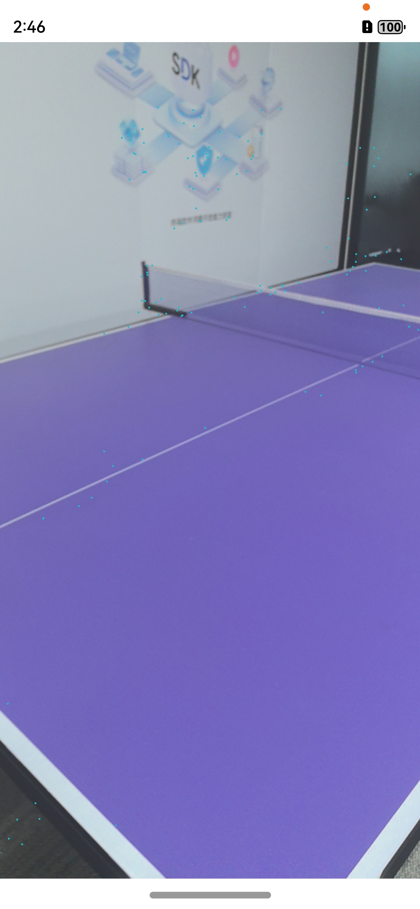

# AREngine

## 介绍

本示例展示了AREngine提供的平面检测，运动跟踪，环境跟踪和碰撞检测能力。

## 效果预览

|              **应用首页**               |                   **识别平面点云**                   |               **识别平面**               |         **通过碰撞检测显示模型**            |
|:-----------------------------------:|:----------------------------------------------:|:----------------------------------------:|:---------------------------------------:|
|  |  |  |  |

1. 在手机的主屏幕，点击“ArSample”，启动应用，在主界面可见“ArWorld”按钮。
2. 点击“ArWorld”按钮，拉起ArEngine平面识别界面，对准地面，桌面，墙面等平面缓慢移动扫描，即可识别到平面并绘制到屏幕上。
3. 识别出平面后，点击平面上某个点，通过AREngine提供的命中检测的能力，会在屏幕被点击位置放置一个3d模型。

## 具体实现
### 集成服务
使用AREngine服务接口需要在CMakeLists中引入依赖：
find_library(
arengine-lib
libarengine_ndk.z.so
)
target_link_libraries(entry PUBLIC
${arengine-lib}
)

使用时引入头文件
#include "ar/ar_engine_core.h"

### 创建会话和帧数据相关接口
AREngine_ARStatus HMS_AREngine_ARConfig_Create(const AREngine_ARSession *session, AREngine_ARConfig **outConfig);
void HMS_AREngine_ARConfig_Destroy(AREngine_ARConfig *config);

AREngine_ARStatus HMS_AREngine_ARSession_Create(void *env, void *applicationContext, AREngine_ARSession **outSessionPointer);
AREngine_ARStatus HMS_AREngine_ARSession_Configure(AREngine_ARSession *session, const AREngine_ARConfig *config);
void HMS_AREngine_ARSession_Destroy(AREngine_ARSession *session);

AREngine_ARStatus HMS_AREngine_ARFrame_Create(const AREngine_ARSession *session, AREngine_ARFrame **outFrame);
void HMS_AREngine_ARFrame_Destroy(AREngine_ARFrame *frame);

### 点云识别相关接口：
AREngine_ARStatus HMS_AREngine_ARPose_Create(const AREngine_ARSession *session, const float *poseRaw, const uint32_t poseRawSize, AREngine_ARPose **outPose);
AREngine_ARStatus HMS_AREngine_ARPose_GetPoseRaw(const AREngine_ARSession *session, const AREngine_ARPose *pose, float *outPoseRaw, int32_t poseRawSize);
AREngine_ARStatus HMS_AREngine_ARPose_GetMatrix(const AREngine_ARSession *session, const AREngine_ARPose *pose, float *outMatrixColMajor4x4, int32_t matrixColMajor4x4Size);
void HMS_AREngine_ARPose_Destroy(AREngine_ARPose *pose);

AREngine_ARStatus HMS_AREngine_ARAnchor_GetTrackingState(const AREngine_ARSession *session, const AREngine_ARAnchor *anchor, AREngine_ARTrackingState *outTrackingState);
AREngine_ARStatus HMS_AREngine_ARAnchor_GetPose(const AREngine_ARSession *session, const AREngine_ARAnchor *anchor, AREngine_ARPose *outPose);

### 平面识别相关接口：
AREngine_ARStatus HMS_AREngine_ARTrackableList_Create(const AREngine_ARSession *session, AREngine_ARTrackableList **outTrackableList);
AREngine_ARStatus HMS_AREngine_ARSession_GetAllTrackables(const AREngine_ARSession *session, AREngine_ARTrackableType filterType, AREngine_ARTrackableList *outTrackableList);
AREngine_ARStatus HMS_AREngine_ARTrackableList_GetSize(const AREngine_ARSession *session, const AREngine_ARTrackableList *trackableList, int32_t *outSize);
AREngine_ARStatus HMS_AREngine_ARTrackableList_AcquireItem(const AREngine_ARSession *session, const AREngine_ARTrackableList *trackableList, int32_t index, AREngine_ARTrackable **outTrackable);
void HMS_AREngine_ARTrackableList_Destroy(AREngine_ARTrackableList *trackableList);

AREngine_ARStatus HMS_AREngine_ARTrackable_GetTrackingState(const AREngine_ARSession *session, const AREngine_ARTrackable *trackable, AREngine_ARTrackingState *outTrackingState);
void HMS_AREngine_ARTrackable_Release(AREngine_ARTrackable *trackable);

AREngine_ARStatus HMS_AREngine_ARPlane_AcquireSubsumedBy(const AREngine_ARSession *session, const AREngine_ARPlane *plane, AREngine_ARPlane **outSubsumedBy);
AREngine_ARStatus HMS_AREngine_ARPlane_AcquireSubsumedBy(const AREngine_ARSession *session, const AREngine_ARPlane *plane, AREngine_ARPlane **outSubsumedBy);
AREngine_ARStatus HMS_AREngine_ARPlane_GetCenterPose(const AREngine_ARSession *session, const AREngine_ARPlane *plane, AREngine_ARPose *outPose);
AREngine_ARStatus HMS_AREngine_ARPlane_GetPolygonSize(const AREngine_ARSession *session, const AREngine_ARPlane *plane, int32_t *outPolygonSize);
AREngine_ARStatus HMS_AREngine_ARPlane_GetPolygon(const AREngine_ARSession *session, const AREngine_ARPlane *plane, float *outPolygonXz, int32_t polygonSize);
AREngine_ARStatus HMS_AREngine_ARPlane_IsPoseInPolygon(const AREngine_ARSession *session, const AREngine_ARPlane *plane, const AREngine_ARPose *pose, int32_t *outPoseInPolygon);

### 碰撞检测相关接口：
AREngine_ARStatus HMS_AREngine_ARHitResultList_Create(const AREngine_ARSession *session, AREngine_ARHitResultList **outHitResultList);
AREngine_ARStatus HMS_AREngine_ARHitResultList_GetSize(const AREngine_ARSession *session, const AREngine_ARHitResultList *hitResultList, int32_t *outSize);
AREngine_ARStatus HMS_AREngine_ARHitResultList_GetItem(const AREngine_ARSession *session, const AREngine_ARHitResultList *hitResultList, int32_t index, AREngine_ARHitResult *outHitResult);
void HMS_AREngine_ARHitResultList_Destroy(AREngine_ARHitResultList *hitResultList);

AREngine_ARStatus HMS_AREngine_ARHitResult_AcquireNewAnchor(AREngine_ARSession *session, AREngine_ARHitResult *hitResult, AREngine_ARAnchor **outAnchor);
AREngine_ARStatus HMS_AREngine_ARHitResult_GetHitPose(const AREngine_ARSession *session, const AREngine_ARHitResult *hitResult, AREngine_ARPose *outPose);
AREngine_ARStatus HMS_AREngine_ARHitResult_AcquireTrackable(const AREngine_ARSession *session, const AREngine_ARHitResult *hitResult, AREngine_ARTrackable **outTrackable);
void HMS_AREngine_ARHitResult_Destroy(AREngine_ARHitResult *hitResult);

## 相关权限

使用相机，加速度传感器和陀螺仪传感器权限，相机权限由应用申请。

## 依赖

依赖设备具备相机，加速度传感器和陀螺仪传感器能力。

## 约束与限制

1. 本实例仅支持标准系统上运行，支持设备：华为手机（mate 60, mate 60pro, mate x5）。
2. HarmonyOS系统：HarmonyOS NEXT Developer Beta1及以上。
3. DevEco Studio版本：DevEco Studio NEXT Developer Beta1及以上。
4. HarmonyOS SDK版本：HarmonyOS NEXT Developer Beta1 SDK及以上。