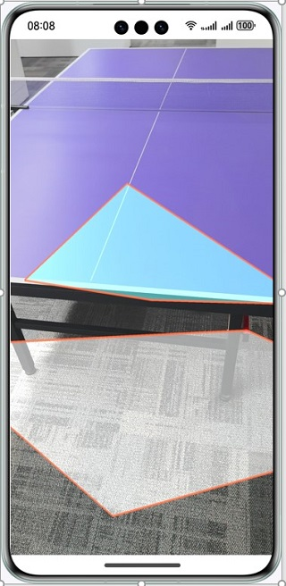
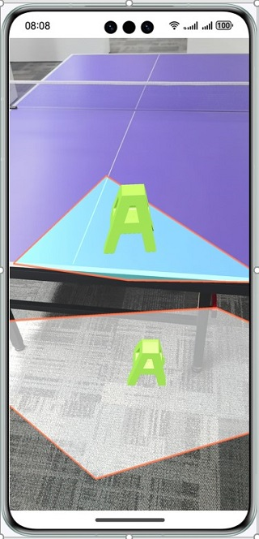
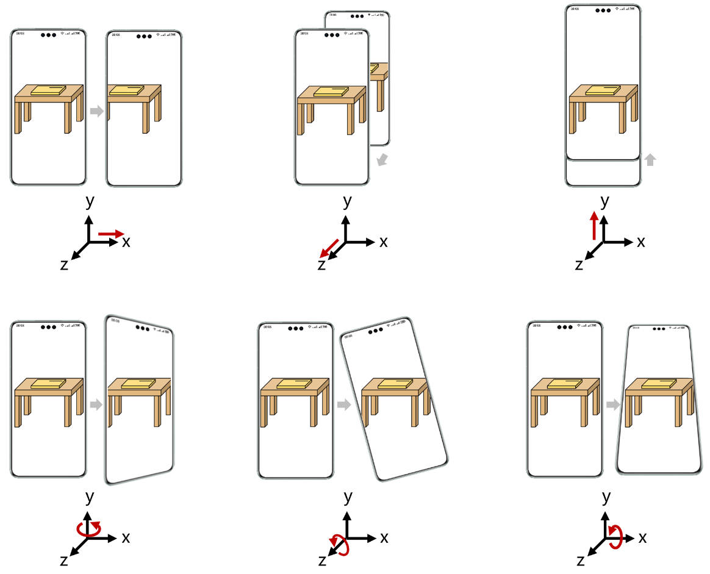

# AREngine

## 介绍

本示例展示了AREngine提供的平面检测，运动跟踪，环境跟踪和命中检测能力。

## 效果预览

|    **应用首页**                         |                 **识别平面**                 |         **通过命中检测显示模型**            |
|:-----------------------------------:|:----------------------------------------:|:---------------------------------------:|
|  |  |  |


1. 在手机的主屏幕，点击“ArSample”，启动应用，在主界面可见“ArWorld”按钮。
2. 点击“ArWorld”按钮，拉起ArEngine平面识别界面，对准地面，桌面，墙面等平面缓慢移动扫描，即可识别到平面并绘制到屏幕上。
3. 识别出平面后，点击平面上某个点，通过AREngine提供的命中检测的能力，会在屏幕被点击位置放置一个3d模型。


## 具体实现
### 集成服务
使用AREngine服务接口需要在CMakeLists中引入依赖：
```cpp
find_library(
arengine-lib
libarengine_ndk.z.so
)
target_link_libraries(entry PUBLIC
${arengine-lib}
)
```

使用时引入头文件
#include "ar/ar_engine_core.h"

### 代码结构解析
```cpp
├─entry/src/main
│  module.json5                                            // 模块的配置文件。              
│ 
├─cpp                                                      // C++代码区。
│  │  CMakeLists.txt                                       // CMake配置文件。
│  │
│  ├─src
│  │  │  app_napi.h                                        // 业务侧虚基类。
│  │  │  global.cpp                                        // napi初始化。
│  │  │  global.h                                          // C++和ets接口映射配置。
│  │  │  module.cpp                                        // C++接口注册。
│  │  │  napi_manager.cpp                                  // C++接口实现。
│  │  │  napi_manager.h
│  │  │
│  │  ├─graphic                                            // 渲染相关工具类
│  │  │
│  │  ├─utils                                              // util工具类。                                                               
│  │  │
│  │  └─world                                              // ArWorld模块。
│  │          world_ar_application.cpp                     // ArWorld模块接口实现。
│  │          world_ar_application.h
│  │          world_background_renderer.cpp                // 背景渲染。
│  │          world_background_renderer.h
│  │          world_object_renderer.cpp                    // 3D物体渲染。
│  │          world_object_renderer.h
│  │          world_plane_renderer.cpp                     // 平面渲染。
│  │          world_plane_renderer.h
│  │          world_render_manager.cpp                     // 每一帧渲染。
│  │          world_render_manager.h
│  │
│  ├─thirdparty                                            // 渲染相关三方库
│  └─types                                                 // 接口存放文件夹。
│      └─libentry
│              index.d.ts                                  // 接口文件。
│              oh-package.json5                            // 接口注册配置文件。
│
├─ets                                                      // ets代码区。
│  ├─entryability
│  │      EntryAbility.ets                                 // 程序入口类。
│  │
│  ├─pages
│  │      ArWorld.ets                                      // ArWorld界面。
│  │      Selector.ets                                     // 主界面。
│  │
│  └─utils
│          Logger.ets                                      // ets日志打印。
│
└─resources                                                // 资源文件目录。
```

### 创建会话和帧数据相关接口
```c
AREngine_ARStatus HMS_AREngine_ARConfig_Create(const AREngine_ARSession *session, AREngine_ARConfig **outConfig);
void HMS_AREngine_ARConfig_Destroy(AREngine_ARConfig *config);

AREngine_ARStatus HMS_AREngine_ARSession_Create(void *env, void *applicationContext, AREngine_ARSession **outSessionPointer);
AREngine_ARStatus HMS_AREngine_ARSession_Configure(AREngine_ARSession *session, const AREngine_ARConfig *config);
void HMS_AREngine_ARSession_Destroy(AREngine_ARSession *session);

AREngine_ARStatus HMS_AREngine_ARFrame_Create(const AREngine_ARSession *session, AREngine_ARFrame **outFrame);
void HMS_AREngine_ARFrame_Destroy(AREngine_ARFrame *frame);
```

### 平面识别相关接口：
```c
AREngine_ARStatus HMS_AREngine_ARTrackableList_Create(const AREngine_ARSession *session, AREngine_ARTrackableList **outTrackableList);
AREngine_ARStatus HMS_AREngine_ARSession_GetAllTrackables(const AREngine_ARSession *session, AREngine_ARTrackableType filterType, AREngine_ARTrackableList *outTrackableList);
AREngine_ARStatus HMS_AREngine_ARTrackableList_GetSize(const AREngine_ARSession *session, const AREngine_ARTrackableList *trackableList, int32_t *outSize);
AREngine_ARStatus HMS_AREngine_ARTrackableList_AcquireItem(const AREngine_ARSession *session, const AREngine_ARTrackableList *trackableList, int32_t index, AREngine_ARTrackable **outTrackable);
void HMS_AREngine_ARTrackableList_Destroy(AREngine_ARTrackableList *trackableList);

AREngine_ARStatus HMS_AREngine_ARTrackable_GetTrackingState(const AREngine_ARSession *session, const AREngine_ARTrackable *trackable, AREngine_ARTrackingState *outTrackingState);
void HMS_AREngine_ARTrackable_Release(AREngine_ARTrackable *trackable);

AREngine_ARStatus HMS_AREngine_ARPlane_AcquireSubsumedBy(const AREngine_ARSession *session, const AREngine_ARPlane *plane, AREngine_ARPlane **outSubsumedBy);
AREngine_ARStatus HMS_AREngine_ARPlane_AcquireSubsumedBy(const AREngine_ARSession *session, const AREngine_ARPlane *plane, AREngine_ARPlane **outSubsumedBy);
AREngine_ARStatus HMS_AREngine_ARPlane_GetCenterPose(const AREngine_ARSession *session, const AREngine_ARPlane *plane, AREngine_ARPose *outPose);
AREngine_ARStatus HMS_AREngine_ARPlane_GetPolygonSize(const AREngine_ARSession *session, const AREngine_ARPlane *plane, int32_t *outPolygonSize);
AREngine_ARStatus HMS_AREngine_ARPlane_GetPolygon(const AREngine_ARSession *session, const AREngine_ARPlane *plane, float *outPolygonXz, int32_t polygonSize);
AREngine_ARStatus HMS_AREngine_ARPlane_IsPoseInPolygon(const AREngine_ARSession *session, const AREngine_ARPlane *plane, const AREngine_ARPose *pose, int32_t *outPoseInPolygon);
```
### 命中检测相关接口：
```c
AREngine_ARStatus HMS_AREngine_ARHitResultList_Create(const AREngine_ARSession *session, AREngine_ARHitResultList **outHitResultList);
AREngine_ARStatus HMS_AREngine_ARHitResultList_GetSize(const AREngine_ARSession *session, const AREngine_ARHitResultList *hitResultList, int32_t *outSize);
AREngine_ARStatus HMS_AREngine_ARHitResultList_GetItem(const AREngine_ARSession *session, const AREngine_ARHitResultList *hitResultList, int32_t index, AREngine_ARHitResult *outHitResult);
void HMS_AREngine_ARHitResultList_Destroy(AREngine_ARHitResultList *hitResultList);

AREngine_ARStatus HMS_AREngine_ARHitResult_AcquireNewAnchor(AREngine_ARSession *session, AREngine_ARHitResult *hitResult, AREngine_ARAnchor **outAnchor);
AREngine_ARStatus HMS_AREngine_ARHitResult_GetHitPose(const AREngine_ARSession *session, const AREngine_ARHitResult *hitResult, AREngine_ARPose *outPose);
AREngine_ARStatus HMS_AREngine_ARHitResult_AcquireTrackable(const AREngine_ARSession *session, const AREngine_ARHitResult *hitResult, AREngine_ARTrackable **outTrackable);
void HMS_AREngine_ARHitResult_Destroy(AREngine_ARHitResult *hitResult);
```
### 运动跟踪能力图文介绍：
AR Engine通过获取终端设备摄像头数据，结合图像特征和惯性传感器（IMU），计算设备位置（沿x、y、z轴方向位移）和姿态（绕x、y、z轴旋转），实现6自由度（6DoF）运动跟踪能力。

6DoF运动跟踪能力示意图（红色线代表设备运动方向）



## 相关权限

使用相机，加速度传感器和陀螺仪传感器权限，相机权限由应用申请。

## 依赖

依赖设备具备相机，加速度传感器和陀螺仪传感器能力。

## 约束与限制

1. 本实例仅支持标准系统上运行，支持设备：华为手机（mate 60, mate 60pro, mate x5）。
2. DevEco Studio版本：DevEco Studio NEXT Developer Beta2及以上。
3. HarmonyOS SDK版本：HarmonyOS NEXT Developer Beta2及以上。