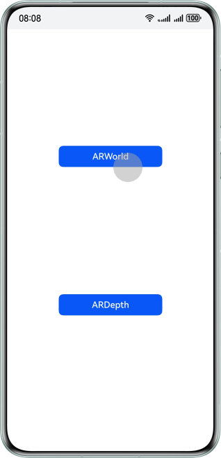
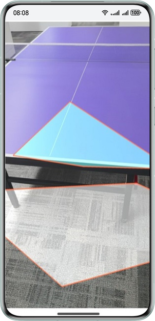
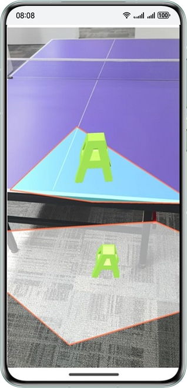
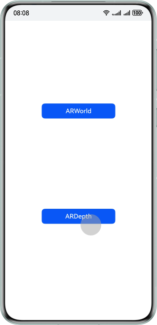
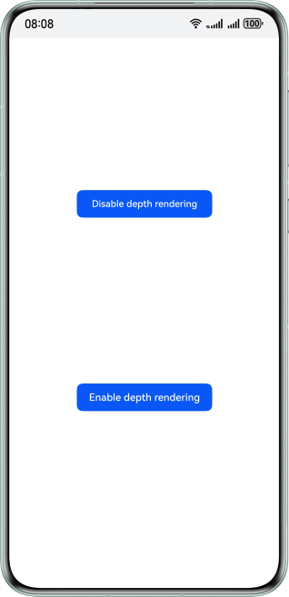
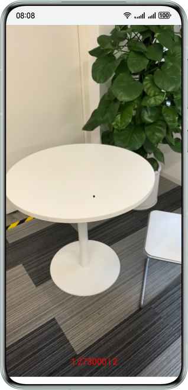
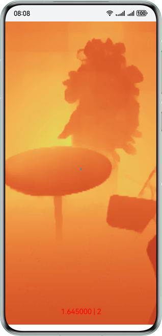
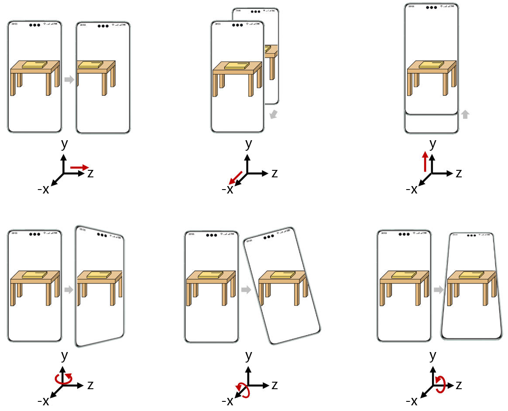

# AREngine

## Overview

AR Engine offers AR capabilities for apps to merge the virtual world with the real world, offering consumers a new
visual experience and way of interaction.

This sample code illustrates the plane detection, motion tracking, environment tracking, and hit testing capabilities
provided by AR Engine.

- Motion tracking capability: Obtains the pose of a device at any time in space in real time.
- Environment tracking capability: Tracks planes around the device, for naturally integrating virtual objects into
  the physical world.
- Hit testing capability: Allow users to select points of interest (POIs) in the real environment by tapping on
  the device screen, to interact with virtual objects.

## Preview

### ARWorld preview

|      **App home screen**      |       **Recognize plane**        | **Display model through hit testing** |
|:-----------------------------:|:--------------------------------:|:-------------------------------------:|
|  |  |         |

1. On the home screen of your phone, tap **ARSample** to start the app. You'll find an **ARWorld** button on the app
   home screen.
2. Tap **ARWorld** to start the plane recognition screen of AR Engine. Slowly move your phone while pointing it at
   the ground, table, wall, or other flat surfaces to scan for planes. Recognized planes will be drawn on the screen.
3. Tap any point on an identified plane and a 3D model will be placed at the tapped position on the screen using
   the hit testing capability of AR Engine.

### ARDepth preview

|      **App home screen**       |     **Depth mode selection**      |    **Depth rendering disabled**    |   **Depth rendering enabled**    |
|:------------------------------:|:---------------------------------:|:----------------------------------:|:--------------------------------:|
|  |  |  |  |

1. On the home screen of your phone, tap **ARSample** to start the app. You'll find an **ARDepth** button on the app
   home screen.
2. Choose whether to enable depth rendering.
3. The AR scene will appear, with the center point on the screen representing the camera's position relative to the
   target point. The distance will also be shown on the screen.
4. Enable depth rendering. The rendered image will be displayed on the screen.

## Usage Instructions

Developers can open this project using DevEco, sign it, and directly run it on a real device.

## Project Directory

```cpp
├──entry/src/main
│
├──module.json5                                     // Module configuration file
│
├──cpp                                              // C++ code area
│  ├──CMakeLists.txt                                // CMake configuration file
│  │
│  ├──src
│  │  ├──app_napi.h                                 // Virtual base class on the service side
│  │  ├──global.cpp                                 // NAPI initialization
│  │  ├──global.h                                   // Mapping configuration between C++ and ETS APIs
│  │  ├──module.cpp                                 // C++ API registration
│  │  ├──napi_manager.cpp                           // C++ API implementation
│  │  ├──napi_manager.h
│  │  │
│  │  ├──depth                                      // ARDepth module
│  │  │  ├──depth_ar_application.cpp                // ARDepth module API implementation
│  │  │  ├──depth_ar_application.h
│  │  │  ├──depth_background_no_renderer.cpp        // Background rendering
│  │  │  ├──depth_background_no_renderer.h
│  │  │  ├──depth_background_renderer.cpp           // Depth rendering for background
│  │  │  ├──depth_background_renderer.h
│  │  │  ├──depth_render_manager.cpp                // Rendering of each frame
│  │  │  └──depth_render_manager.h
│  │  │
│  │  ├──graphic                                    // Rendering-related utility class
│  │  │
│  │  ├──utils                                      // Utility class
│  │  │
│  │  └──world                                      // ARWorld module
│  │     ├──world_ar_application.cpp                // ARWorld module API implementation
│  │     ├──world_ar_application.h
│  │     ├──world_background_renderer.cpp           // Background rendering
│  │     ├──world_background_renderer.h
│  │     ├──world_object_renderer.cpp               // 3D object rendering
│  │     ├──world_object_renderer.h
│  │     ├──world_plane_renderer.cpp                // Plane rendering
│  │     ├──world_plane_renderer.h
│  │     ├──world_render_manager.cpp                // Rendering of each frame
│  │     └──world_render_manager.h
│  │
│  ├──thirdparty                                    // Rendering-related third-party libraries
│  │
│  └──types                                         // Folder for storing APIs
│     └──libentry
│        ├──index.d.ts                              // API file
│        └──oh-package.json5                        // API registration configuration file
│
├──ets                                              // ETS code area
│  ├──entryability
│  │  └──EntryAbility.ets                           // Entry point class
│  │
│  ├──pages
│  │  ├──ARDepth.ets                                // ARDepth mode selection screen
│  │  ├──ARDepthRender.ets                          // ARDepth screen
│  │  ├──ARWorld.ets                                // ARWorld screen
│  │  └──Selector.ets                               // Home screen
│  │
│  └──utils                                         // Utility class
│
└──resources                                        // Directory of resource files
```

## How to Implement

### Integrating a service

To use AR Engine APIs, you need to add the following dependencies to **CMakeLists**:

```cmake
find_library(
    arengine-lib
    libarengine_ndk.z.so
)
target_link_libraries(entry PUBLIC
    ${arengine-lib}
)
```

Import the header file:

```c
#include "ar/ar_engine_core.h"
```

### APIs for creating sessions and frame data

```c
AREngine_ARStatus HMS_AREngine_ARConfig_Create(const AREngine_ARSession *session, AREngine_ARConfig **outConfig);
void HMS_AREngine_ARConfig_Destroy(AREngine_ARConfig *config);

AREngine_ARStatus HMS_AREngine_ARSession_Create(void *env, void *applicationContext, AREngine_ARSession **outSessionPointer);
AREngine_ARStatus HMS_AREngine_ARSession_Configure(AREngine_ARSession *session, const AREngine_ARConfig *config);
void HMS_AREngine_ARSession_Destroy(AREngine_ARSession *session);

AREngine_ARStatus HMS_AREngine_ARFrame_Create(const AREngine_ARSession *session, AREngine_ARFrame **outFrame);
void HMS_AREngine_ARFrame_Destroy(AREngine_ARFrame *frame);
```

### APIs for plane recognition

```c
AREngine_ARStatus HMS_AREngine_ARTrackableList_Create(const AREngine_ARSession *session, AREngine_ARTrackableList **outTrackableList);
AREngine_ARStatus HMS_AREngine_ARSession_GetAllTrackables(const AREngine_ARSession *session, AREngine_ARTrackableType filterType, AREngine_ARTrackableList *outTrackableList);
AREngine_ARStatus HMS_AREngine_ARTrackableList_GetSize(const AREngine_ARSession *session, const AREngine_ARTrackableList *trackableList, int32_t *outSize);
AREngine_ARStatus HMS_AREngine_ARTrackableList_AcquireItem(const AREngine_ARSession *session, const AREngine_ARTrackableList *trackableList, int32_t index, AREngine_ARTrackable **outTrackable);
void HMS_AREngine_ARTrackableList_Destroy(AREngine_ARTrackableList *trackableList);

AREngine_ARStatus HMS_AREngine_ARTrackable_GetTrackingState(const AREngine_ARSession *session, const AREngine_ARTrackable *trackable, AREngine_ARTrackingState *outTrackingState);
void HMS_AREngine_ARTrackable_Release(AREngine_ARTrackable *trackable);

AREngine_ARStatus HMS_AREngine_ARPlane_AcquireSubsumedBy(const AREngine_ARSession *session, const AREngine_ARPlane *plane, AREngine_ARPlane **outSubsumedBy);
AREngine_ARStatus HMS_AREngine_ARPlane_AcquireSubsumedBy(const AREngine_ARSession *session, const AREngine_ARPlane *plane, AREngine_ARPlane **outSubsumedBy);
AREngine_ARStatus HMS_AREngine_ARPlane_GetCenterPose(const AREngine_ARSession *session, const AREngine_ARPlane *plane, AREngine_ARPose *outPose);
AREngine_ARStatus HMS_AREngine_ARPlane_GetPolygonSize(const AREngine_ARSession *session, const AREngine_ARPlane *plane, int32_t *outPolygonSize);
AREngine_ARStatus HMS_AREngine_ARPlane_GetPolygon(const AREngine_ARSession *session, const AREngine_ARPlane *plane, float *outPolygonXz, int32_t polygonSize);
AREngine_ARStatus HMS_AREngine_ARPlane_IsPoseInPolygon(const AREngine_ARSession *session, const AREngine_ARPlane *plane, const AREngine_ARPose *pose, int32_t *outPoseInPolygon);
```

### APIs for hit testing

```c
AREngine_ARStatus HMS_AREngine_ARHitResultList_Create(const AREngine_ARSession *session, AREngine_ARHitResultList **outHitResultList);
AREngine_ARStatus HMS_AREngine_ARHitResultList_GetSize(const AREngine_ARSession *session, const AREngine_ARHitResultList *hitResultList, int32_t *outSize);
AREngine_ARStatus HMS_AREngine_ARHitResultList_GetItem(const AREngine_ARSession *session, const AREngine_ARHitResultList *hitResultList, int32_t index, AREngine_ARHitResult *outHitResult);
void HMS_AREngine_ARHitResultList_Destroy(AREngine_ARHitResultList *hitResultList);

AREngine_ARStatus HMS_AREngine_ARHitResult_AcquireNewAnchor(AREngine_ARSession *session, AREngine_ARHitResult *hitResult, AREngine_ARAnchor **outAnchor);
AREngine_ARStatus HMS_AREngine_ARHitResult_GetHitPose(const AREngine_ARSession *session, const AREngine_ARHitResult *hitResult, AREngine_ARPose *outPose);
AREngine_ARStatus HMS_AREngine_ARHitResult_AcquireTrackable(const AREngine_ARSession *session, const AREngine_ARHitResult *hitResult, AREngine_ARTrackable **outTrackable);
void HMS_AREngine_ARHitResult_Destroy(AREngine_ARHitResult *hitResult);
```

### APIs for depth estimation

```c
AREngine_ARStatus HMS_AREngine_ARConfig_SetDepthMode(const AREngine_ARSession *session, AREngine_ARConfig *config, AREngine_ARDepthMode depthMode);
AREngine_ARStatus HMS_AREngine_ARFrame_AcquireDepthImage16Bits(const AREngine_ARSession *session, const AREngine_ARFrame *frame, AREngine_ARImage **outDepthImage);
AREngine_ARStatus HMS_AREngine_ARFrame_AcquireDepthConfidenceImage(const AREngine_ARSession *session, const AREngine_ARFrame *frame, AREngine_ARImage **outConfidenceImage);
```

### About motion tracking capability

AR Engine acquires camera data from the device, combines it with image features and the inertial measurement unit
(IMU) sensor, calculates the device's position (translation along the x, y, and z axes) and pose (rotation around
the x, y, and z axes) to achieve 6 degrees of freedom (6DoF) motion tracking.

6DoF motion tracking (the red arrows indicate the device's moving directions)


## Required Permissions

1. Camera permission: **ohos.permission.CAMERA**
2. Accelerometer sensor permission: **ohos.permission.ACCELEROMETER**
3. Gyroscope permission: **ohos.permission.GYROSCOPE**

## Constraints

1. The sample is supported only on devices running the standard system, not on emulators.

   <table>
     <tr>
       <th>Device Type</th>
       <th>Product Series</th>
       <th>Product Model</th>
     </tr>
     <tr>
       <td rowspan="4">Phone</td>
       <td>Mate Series</td>
       <td>Mate 60, Mate 60 RS ULTIMATE DESIGN, Mate 60 Pro, Mate 60 Pro+, Mate 70, Mate 70 RS ULTIMATE DESIGN, Mate 70 Pro, Mate 70 Pro+, Mate X5, Mate X6, and Mate XT ULTIMATE DESIGN</td>
     </tr>
     <tr>
       <td>Pura Series</td>
       <td>Pura 70, Pura 70 Pro, Pura 70 Pro+, Pura 70 Ultra, and Pura X</td>
     </tr>
     <tr>
       <td>Nova Series</td>
       <td>Nova 12 Pro</td>
     </tr>
     <tr>
       <td>Pocket Series</td>
       <td>Pocket 2</td>
     </tr>
     <tr>
       <td>Tablet</td>
       <td>MatePad Series</td>
       <td>MatePad Pro 13.2</td>
     </tr>
   </table>

2. It is recommended that DevEco Studio 5.0.5 Release or later be used.
3. This sample is based on the stage model. It is recommended that HarmonyOS 5.0.5 Release SDK or later be used.

## AR Engine Depth Estimation Technology Limitations and Disclaimer

1. Technology limitations: The capabilities provided by this feature may have their depth estimation accuracy influenced
   by the following factors:
    1. Ambient lighting conditions (such as strong light, low light, or reflective environments).
    2. Surface material characteristics of objects (such as transparency, mirror-like surfaces, or uniform colors).
    3. Differences in device hardware performance (such as variations in camera/sensor parameters).
    4. Real-time limitations in dynamic scenes, among others.
2. Disclaimer:
   This depth estimation feature is provided solely for functionality and does not constitute a warranty regarding
   product quality or any other commitments. Developers have the sole discretion to decide whether to use the
   functionalities offered by HarmonyOS in developing their apps, and they are entirely responsible for the apps'
   intended purpose, performance, and any associated liabilities. If an app is developed for scenarios such as obstacle
   avoidance for visually impaired individuals or assistance for persons with disabilities, developers must conduct
   extensive multi-scenario stress testing and implement a data validation mechanism. Particularly in safety-related
   contexts, redundant safeguards should be deployed, and it must be ensured that the app is developed and operated in
   full compliance with legal and regulatory requirements. HarmonyOS shall not bear any direct or indirect liability
   arising from such use.

   Additional note on depth estimation functionality:
    1. The depth estimation functionality is not designed as a medical device or life safety system.
    2. Without the proper certifications, the depth estimation functionality should not be used as a medical assistive
       device. It is not intended for use as medical equipment. It also hasn't been approved to meet accessibility or
       life safety standards.

## Change log

### Features of Version 1.1.0 Update

1. **ARDepth** capability launched.<br?
   Depth estimation and depth map rendering features are now available.
2. The project template has been modified to adapt to the latest API17 framework.

### Features of Version 1.0.0 Update

1. **ARWorld** capability launched.<br>
   Plane recognition, collision detection, and object placement features are now available.

## Related documents

[AREngine Development Guide](https://developer.huawei.com/consumer/en/doc/harmonyos-guides/ar-engine-kit-guide)

[AREngine API Reference](https://developer.huawei.com/consumer/en/doc/harmonyos-references/ar-engine-api)
